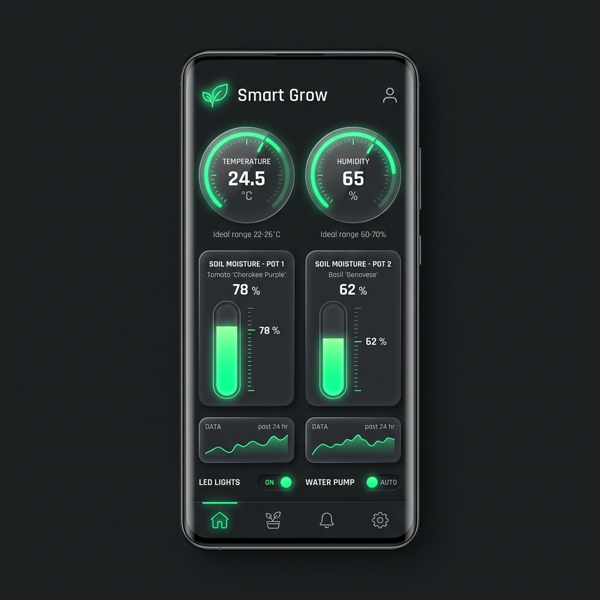

# 🌱 Sensor Grow IoT — Estação de Monitoramento e Dashboard Holográfico

> Dispositivo inteligente de telemetria IoT (Internet of Things) baseado em ESP32 que realiza leitura de sensores climáticos e do solo, possui persistência local resiliente em buffer circular EEPROM, sincronização HTTP em tempo real e um Web Server embarcado com interface holográfica futurista.

---

## 📋 Visão Geral e Contexto de Engenharia

Este projeto consiste em um **nó sensor IoT inteligente** projetado para controle de microclima e umidade de vasos de cultivo (*Grow Room*). 

O firmware atua como um sistema ciber-físico completo, gerenciando de forma concorrente:
1. **Sensoriamento Analógico e Digital:** Amostragem contínua de temperatura, umidade do ar (DHT22) e níveis de umidade capacitiva de múltiplos solos.
2. **Buffer Circular EEPROM:** Lógica de tolerância a falhas que armazena dados consolidados localmente se a rede Wi-Fi estiver indisponível.
3. **Servidor HTTP Embarcado:** Hospedagem direta no chip de uma IHM/Dashboard web responsivo, de estética futurista holográfica (*Holo-Tech*), atualizada dinamicamente.
4. **Sincronização Cloud/REST:** Envio periódico de payloads em formato JSON para servidores externos através de requisições HTTP POST seguras.

---

## 🖥️ O Dashboard Holográfico Embarcado

O firmware armazena na memória flash (`PROGMEM`) um painel completo em HTML5, CSS3 avançado e JavaScript puro. A interface adota uma estética premium de ficção científica (cyberpunk/holográfico) com efeitos de neon, gráficos dinâmicos de agulha e tabelas de histórico que mostram os slots de memória e o status da conexão em tempo real.

Abaixo está o design visual do painel de monitoramento do sistema:



---

## 🔌 Especificações de Conexão de Hardware (Pinagem)

O ESP32 está conectado aos seguintes periféricos:

| Periférico | Pinos GPIO (ESP32) | Protocolo / Tipo | Observação |
|---|---|---|---|
| **Sensor DHT22** | `GPIO 22` | Digital (DHT 1-Wire) | Leitura de Temperatura e Umidade do Ar. |
| **Sensor de Solo 1** | `GPIO 32` | Analógico (ADC1_CH4) | Percentual de Umidade capacitiva do vaso 1. |
| **Sensor de Solo 2** | `GPIO 34` | Analógico (ADC1_CH6) | Percentual de Umidade capacitiva do vaso 2. |

---

## 💾 Resiliência de Dados com Buffer Circular EEPROM

Para garantir que os logs ambientais não sejam perdidos durante quedas de internet (perda de sinal Wi-Fi), implementamos uma lógica de **Buffer Circular na EEPROM**:

```
Endereço EEPROM [0] = Índice do slot ativo (0 a 9)
Endereços [1..161]   = 10 Slots fixos de Registro (16 bytes cada)
  Slot contendo: struct { float temp, umid, solo1, solo2 }
```

* **Funcionamento:** O firmware armazena as últimas 30 amostras na RAM volátil, calcula a média do ciclo (~1 minuto) e tenta enviar via HTTP POST para o endpoint do banco de dados central (`DB_ENDPOINT`).
* **Caso de Sucesso:** Os dados são salvos na nuvem e o slot é atualizado.
* **Caso de Falha (Sem Conexão):** O sistema isola o dado e realiza a gravação física no slot atual da EEPROM local, incrementando o índice circular (`index % 10`). Quando a rede é restabelecida, o histórico permanece disponível para leitura direta via servidor HTTP.

---

## 🚀 Integração e Simulação Online no Wokwi

O projeto está totalmente configurado para execução offline ou online através do emulador de circuitos **Wokwi**:

* `diagram.json` — Desenho esquemático elétrico descrevendo o ESP32, o sensor de umidade DHT22, potenciômetros simulando os sensores capacitivos de solo e conexões lógicas.
* `wokwi.toml` — Configuração do toolchain de simulação local.
* `wokwi-project.txt` — Identificador exclusivo do ecossistema de simulação em nuvem.

### Como Simular Localmente:
1. Instale a extensão do **Wokwi** no VS Code.
2. Abra a pasta do projeto.
3. Inicie o simulador a partir do arquivo `wokwi.toml` ou clicando em iniciar simulação.
4. O terminal exibirá o IP virtual gerado (`192.168.1.xxx` ou similar) que permitirá abrir o painel holográfico diretamente no navegador de sua máquina local!
